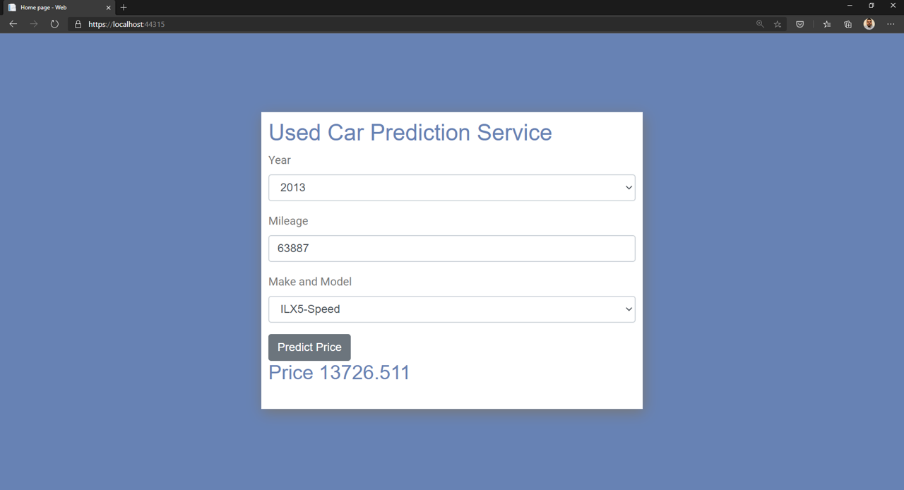

# ML.NET Workshop

Welcome to the ML.NET Workshop!

[ML.NET](https://dot.net/ml) is an open source, cross-platform, machine learning framework for .NET developers. You can use ML.NET to create custom machine learning models without having prior machine learning experience and without leaving the .NET ecosystem.

In this workshop, we will build, train, and consume a machine learning model that predicts the price of used cars based on factors such as car make, model, and mileage. We will also learn about the basics of machine learning, the various ML.NET framework features and tooling, and how to easily get started with ML.NET.

## Project Structure

This app is made up of three projects:

1. **Shared**: .NET Standard library that has shared code
2. **TrainConsole**: .NET Core console app for training the model
3. **Web**: ASP.NET Core Razor Pages app that uses the model to predict car prices

## Getting Started

Go ahead and clone this repo to your machine, then dive in and [get started](/labs/00-get-started.md)!

## Phases

| Phase | Topics |
| ----- | ---- |
| [Phase #0](/labs/00-get-started.md) | Get bits installed and set up your environment |
| [Phase #1](/labs/01-add-ml-context.md) | Install the ML.NET NuGet package, initialize an ML.NET environment |
| [Phase #2](/labs/02-loading-data.md) | Load data for training  |
| [Phase #3](/labs/03-training.md) | Choose data transforms and algorithms, train the model |
| [Phase #4](/labs/04-evaluate.md) | Evaluate model performance |
| [Phase #5](/labs/05-save-model.md) | Save the ML.NET model |
| [Phase #6](/labs/06-consume-model.md) | Consume the model in a web app |

## Addtional Scenarios 

| Scenario | Topics |
| ----- | ---- |
| [Deep Learning](/additional-scenarios/deep-learning.md) | Learn about deep learning, build an image classification model |
| [MLOps](/additional-scenarios/mlops.md) | Learn about MLOps |
