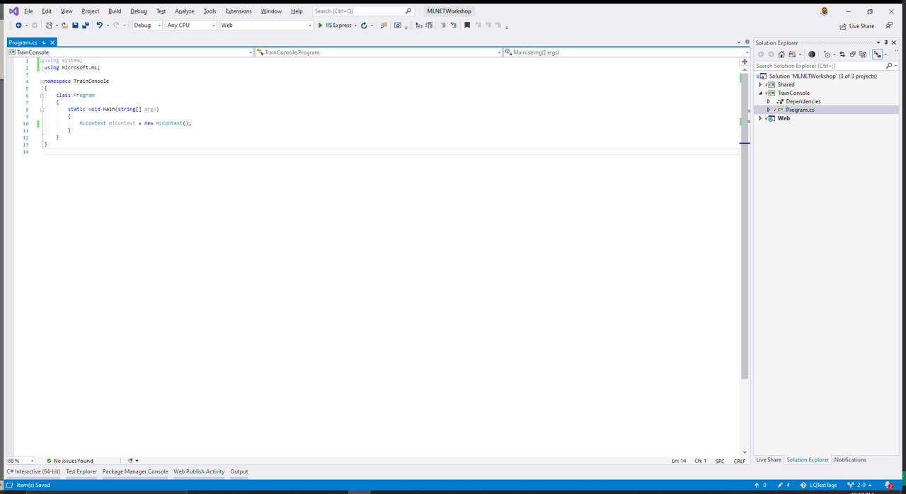

# Add ML Context

In this session, you'll add an `MLContext` to the `TrainingConsole` project. `MLContext` is the starting point for all ML.NET operations. It provides a way to create components for:

- Data preparation
- Feature engineering
- Training
- Prediction
- Model evaluation
- Logging
- Execution control
- Seeding

## Initialize MLContext

Open the `Program.cs` file in the `TrainingConsole` project and add the following `using` statement at the top of the file to reference the `Microsoft.ML` package.

```csharp
using Microsoft.ML;
```

Next, create an instance of `MLContext` in the `Main` method:

```csharp
static void Main(string[] args)
{
    MLContext mlContext = new MLContext();
    //...
}
```



At this point we're not yet ready to work with the `MLContext`, but you should be able to successfully build the application once more.

Next up - [02-loading-data](02-loading-data.md)
