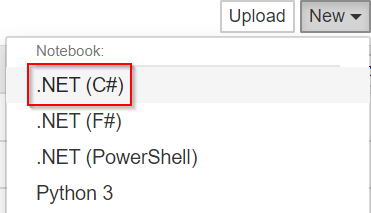
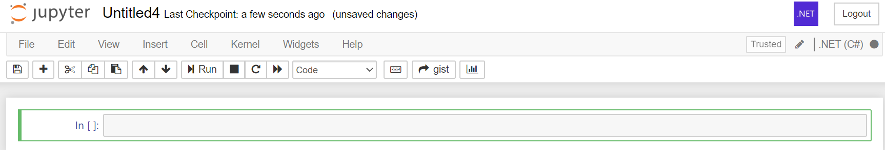
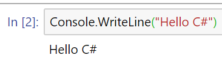

# Phase 8.0: Using C# in a Jupyter Notebook

In this section, you will learn how to use C# within a Jupyter Notebook environment.

[Jupyter](https://jupyter.org/) is an open-source web application that allows for interactive programming. It can contain code, visualizations, and text.

## Phase 8.1: Installing Python and Jupyter
Using Jupyter notebooks requires you to have Python and Jupyter installed. To get both, download [Anaconda](https://www.anaconda.com/products/individual). It is recommended to get the latest download of version 3. Version 2.7 of Python will no longer have any updates to it.


## Phase 8.2: Installing .NET Interactive
Once you have Anaconda installed, in your terminal run the below command to install .NET Interactive.

```bash
dotnet tool install -g --add-source "https://dotnet.myget.org/F/dotnet-try/api/v3/index.json" Microsoft.dotnet-interactive
```

You should get a success message once it got installed.


## Phase 8.3: Installing the .NET Jupyter Kernels
With the .NET Interactive installed, you also need to install the Jupyter Kernels for it. In your terminal, run the below command to install the kernels.

```bash
dotnet interactive jupyter install
```


Once completed, you can run the `jupyter kernelspec list` command to get a list of the installed kernels and make sure the .NET kernels show in the output.


## Phase 8.4: Create .NET Notebook
With everything installed, we can now create a C# notebook in Jupyter. 

Search for the program "Anaconda Prompt" and open it. In that terminal, type `jupyter notebook` and wait for the browser tab to load.

> NOTE: You can also use the `jupyter lab` command for this, if you prefer.

Once Jupyter loads, click the "New" dropdown and select ".NET (C#)" to create a new C# notebook.



A new notebook will be created and the kernel should say that it's using C#.



## Phase 8.5: Test C# Kernel
To make sure the notebook runs C#, we can give it some C# code to test it out.

Type the below code in the first cell and click the Run button in the top menu.


```csharp
Console.WriteLine("Hello C#")
```

> NOTE: You can also use the `CTRL+Enter` keyboard shortcut to run the active cell.



Congratulations! You have now run C# inside a Jupyter notebook!