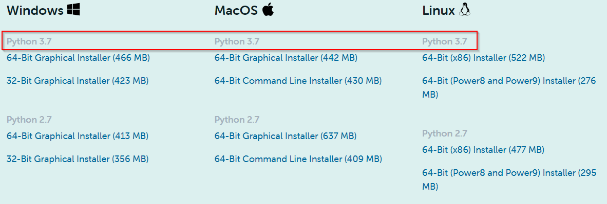
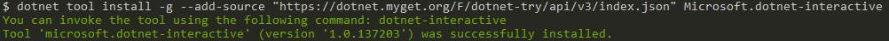
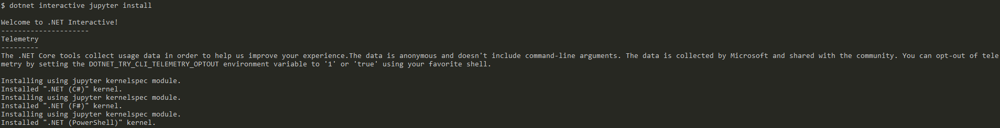
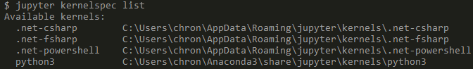

# Phase 8.0: Using C# in a Jupyter Notebook

In this section, you will learn how to use C# within a Jupyter Notebook environment.

## Phase 8.1: Installing Python and Jupyter
Using Jupyter notebooks requires you to have Python and Jupyter installed. To get both, download [Anaconda](https://www.anaconda.com/products/individual). It is recommended to get the latest download of version 3. Version 2.7 of Python will no longer have any updates to it.



## Phase 8.2: Installing .NET Interactive
Once you have Anaconda installed, in your terminal run the below command to install .NET Interactive.

```bash
dotnet tool install -g --add-source "https://dotnet.myget.org/F/dotnet-try/api/v3/index.json" Microsoft.dotnet-interactive
```

You should get a success message once it got installed.



## Phase 8.3: Installing the .NET Jupyter Kernels
With the .NET Interactive installed, you also need to install the Jupyter Kernels for it. In your terminal, run the below command to install the kernels.

```bash
dotnet interactive jupyter install
```



Once completed, you can run the `jupyter kernelspec list` command to get a list of the installed kernels and make sure the .NET kernels show in the output.



## Phase 8.4: Create .NET Notebook

