# Phase 9.0: Using the DataFrame API in Jupyter

In this section, you will learn how to use the [DataFrame API](https://devblogs.microsoft.com/dotnet/an-introduction-to-dataframe/). The DataFrame API can help you load in CSV data and do some analysis, data pre-processing, and visualizations on.

This section will use a C# notebook that was created in the previous section.

## Phase 9.1: Install the DataFrame API in a Notebook

The DataFrame API is a [NuGet package]() that you can download and start using. To install it in a C# Jupyter notebook, use the below command:

```bash
#r "nuget:Microsoft.Data.Analysis"
```

The `#r` command tells the kernel that you want to reference a file or, in this case, a NuGet package. The "nuget" prefix in the string tells it that you want to reference a package from NuGet. After the colon is where you specify the full name of the package you want to reference.

## Phase 9.2: Reference the DataFrame and Plotting API

In another cell, use the below code to reference the DataFrame and plotting APIs. This allows access to the classes and methods from those libraries into the notebook.

```csharp
using Microsoft.Data.Analysis;
using XPlot.Plotly;
```

## Phase 9.3: Register a Formatter

Jupyter doesn't know how to format the data from the DataFrame API, so we need to register a formatter for it. In a new cell, use the below code that creates a formatter.

```csharp
using Microsoft.AspNetCore.Html;
Formatter<DataFrame>.Register((df, writer) =>
{
    var headers = new List<IHtmlContent>();
    headers.Add(th(i("index")));
    headers.AddRange(df.Columns.Select(c => (IHtmlContent) th(c.Name)));
    var rows = new List<List<IHtmlContent>>();
    var take = 10;
    for (var i = 0; i < Math.Min(take, df.Rows.Count); i++)
    {
        var cells = new List<IHtmlContent>();
        cells.Add(td(i));
        foreach (var obj in df.Rows[i])
        {
            cells.Add(td(obj));
        }
        rows.Add(cells);
    }

    var t = table(
        thead(
            headers),
        tbody(
            rows.Select(
                r => tr(r))));

    writer.Write(t);
}, "text/html");
```

Without this formatter the data won't be formatted correctly and we would have a hard time reading it. It would look like the below.

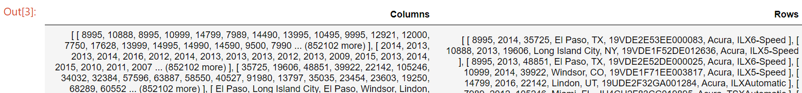

## Phase 9.4: Load the CSV Data

The DataFrame API offers a convenient method to load in the CSV data. In a new cell, use the below code to load in the data into a variable.

```csharp
var data = DataFrame.LoadCsv("../../data/true_car_listings.csv", separator: ',');
```

The `separator` parameter tells the method what delimiter the file has. In this case we have a comma separating each value in the data file.

Next, you can run a new cell with the `data` variable and it will print out the top 10 rows of the data. Notice how well it is formatted since we added the formatter from phase 9.3.

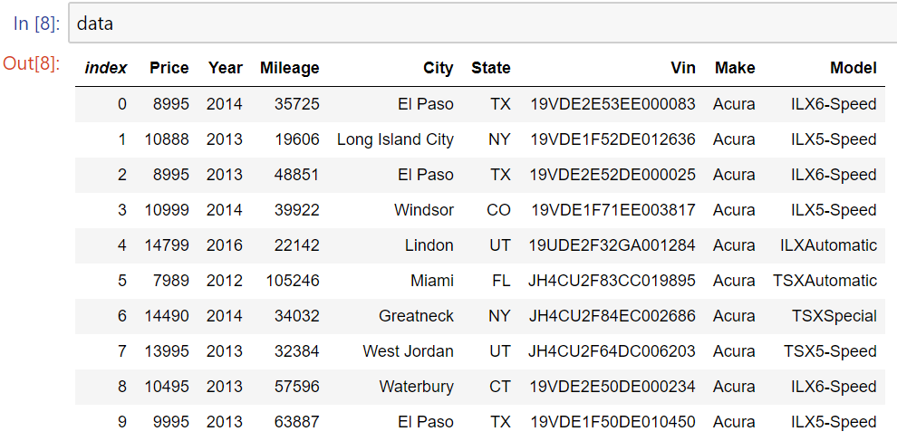

## Phase 9.5: Use Descriptive Data Methods

The DataFrame API has some methods that can be used to help you understand the data a bit more. In a new cell, try using the `Info` method on the data.

```csharp
data.Info()
```

This gives you what data types the DataFrame API has inferred on the columns and the number of rows for each column.

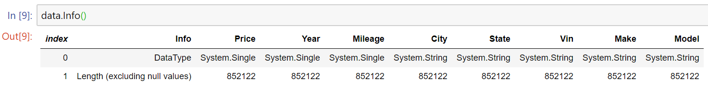

> Hint: You can see if there are any null values in a column by noticing if the number of rows don't all match.

In another cell, use the `Description` method on the data.

```csharp
data.Description()
```

This method gives you descriptive statistics such as the min, max, and mean (average) values of all of the numerical columns in the dataset.

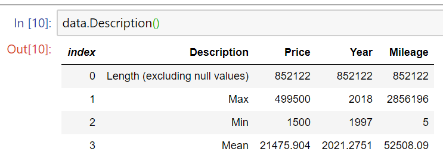

## Phase 9.6: Drop Null Values

Often times datasets will come in with null or missing values. There are several ways to handle null values, such as setting the values to a default value or imputing the mean of the other values. You can also drop any null columns or rows so they aren't used in the dataset.

In a new cell, use the below code to drop any null values and assign the new dataset to a variable.

```csharp
var newData = data.DropNulls();
```

In a new cell, run the `newData` variable to view the top 10 rows from it.

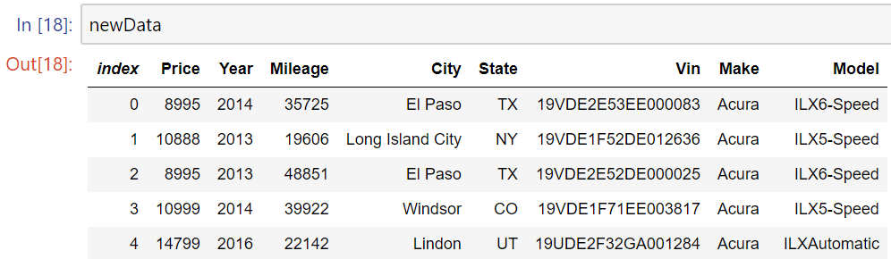

## Phase 9.7: Aggregate the Data

When analyzing data you will often aggregate it to get a different view of the data to help you gain some insights. The DataFrame API has several ways in which you can aggregate your data.

In a new cell, use the below code to group the data by the "Make" column and get the counts of each make.

```csharp
var make = newData.GroupBy("Make").Count();
```

In a new cell, run the `make` variable to view the top 10 rows from it. It will show all columns and they will all have the same value for each row due to counting each row with the make.

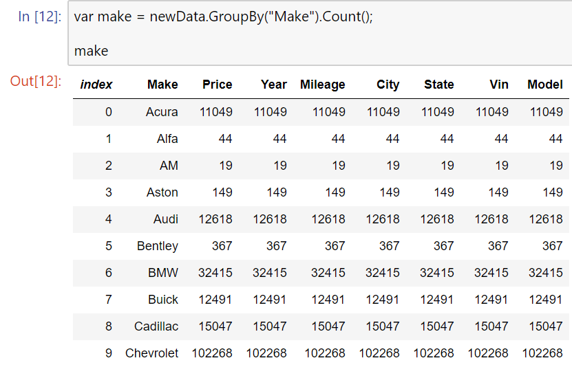

In another cell, run the below code to order the grouped data by the mileage column.

```csharp
make.OrderBy("Mileage")
```

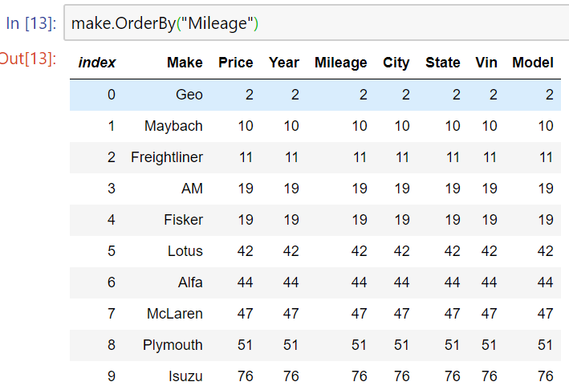

In the next cell, use the below code to order the grouped data by mileage again, but this will order by descending values.

```csharp
make.OrderByDescending("Mileage")
``` 

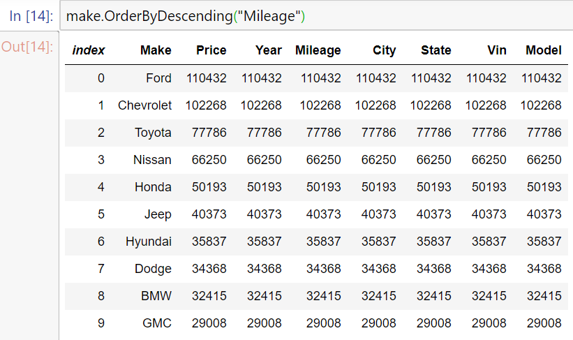

## Phase 9.8: Filtering Data

Along with aggregating data to get a better understanding of it, there may be pieces of the data you care more about than others. Being able to filter out the data that you don't need helps in this case.

In a new cell, use the below code to filter out the "Mileage" column to only show cars that have a mileage greater than or equal to 10,000.

```csharp
var mileage = newData[newData.Columns["Mileage"].ElementwiseGreaterThanOrEqual(100000)];
```
In another cell, run the `mileage` variable to get a view of the data.

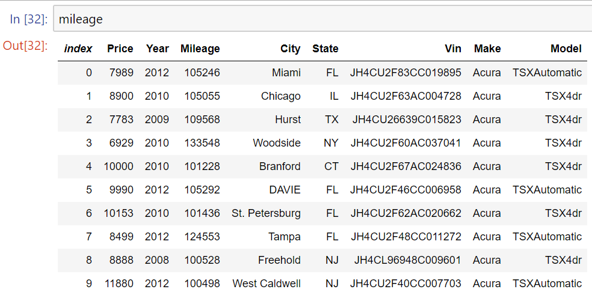

## Phase 9.9: Visualizing the Data

Chances are that there will be too much data in the dataset to manually go through and see any insights from it. Visualization helps in this case. We can make plots of the data in our notebook by using the [XPlot]() package. However, there is no need to get this from NuGet since it is included with .NET Interactive. Since it was referenced earlier in phase 9.2 we can start using it.

In a new cell, use the below code to plot a histogram of the "Price" column.

```csharp
Chart.Plot(
    new Graph.Histogram()
    {
        x = newData.Columns["Price"]
    }
)
```

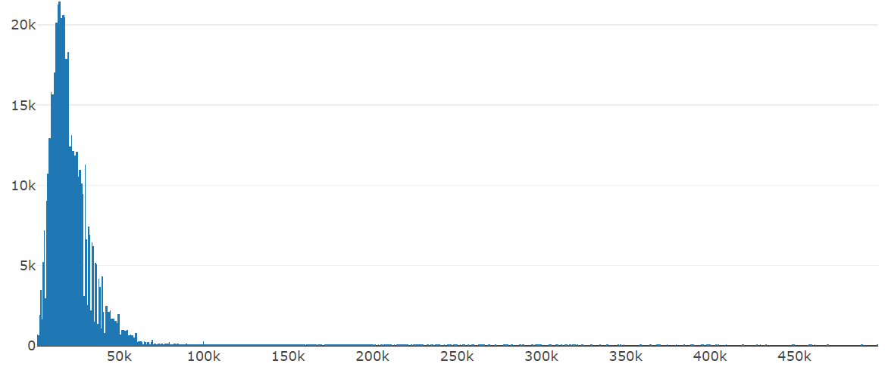

From the histogram, you can tell that most prices are around $15,000.

In another cell, run the below code to plot a bar chart of the "Make" column.

```csharp
Chart.Plot(
    new Graph.Bar
    {
        x = make.Columns["Make"],
        y = make.Columns["Price"]
    }
)
```

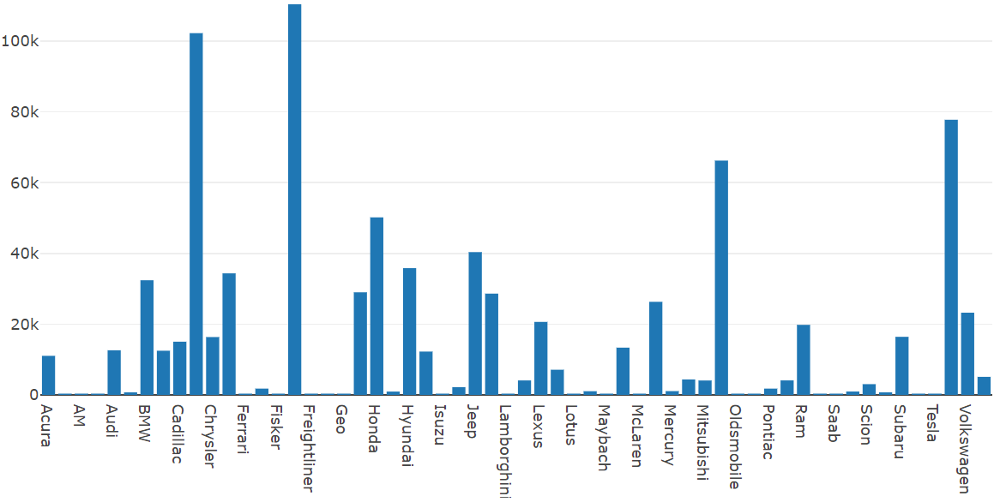

Since we are using the `make` variable for the visualizations, the "y" column will be a total count instead of the "Price" since we grouped the data by "Make" and got the counts of each make. 

From this chart, we can see that Ford, Chevy, and Toyota are the most popular makes.

Congratulations! You have now used the DataFrame API to analyze, pre-process, and visualize data!